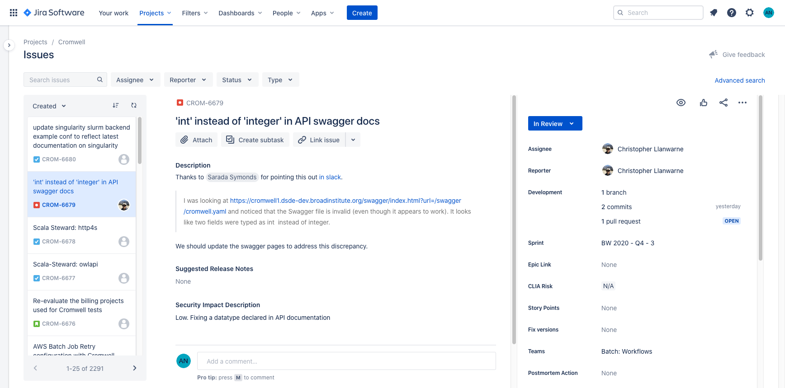

## Welcome to Cromwell

Cromwell is an open-source Workflow Management System for bioinformatics. Licensing is [BSD 3-Clause](LICENSE.txt).

The [Cromwell documentation has a dedicated site](https://cromwell.readthedocs.io/en/stable).

First time to Cromwell? Get started with [Tutorials](https://cromwell.readthedocs.io/en/stable/tutorials/FiveMinuteIntro/).

Thinking about contributing to Cromwell? Get started by reading our [Contributor Guide](CONTRIBUTING.md).

Cromwell has a growing ecosystem of community-backed projects to make your experience even better! Check out our [Ecosystem](https://cromwell.readthedocs.io/en/stable/Ecosystem/) page to learn more.

### Issue tracking in JIRA

<!--
AEN external issue filing tested 2020-12-08 with `oednichols@gmail.com` / `https://broadworkbench.atlassian.net/browse/CROM-6681`
-->

Need to file an issue? Head over to [our JIRA](https://broadworkbench.atlassian.net/jira/software/c/projects/CROM/issues). You must create a free profile to view or create.

Issues in Github remain available for discussion among community members but are not actively monitored by the development team.

