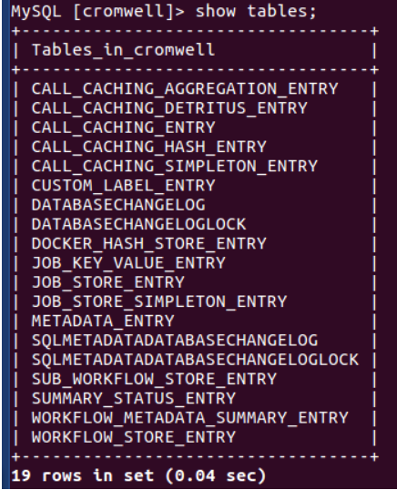
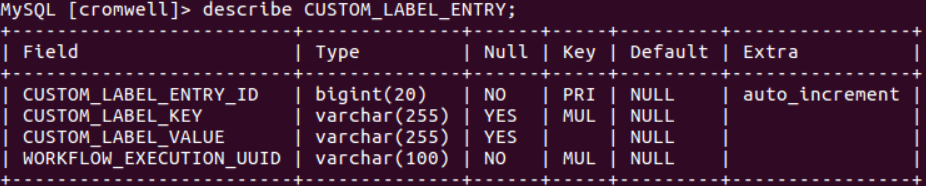
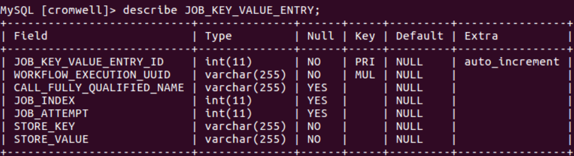
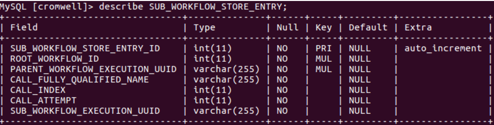
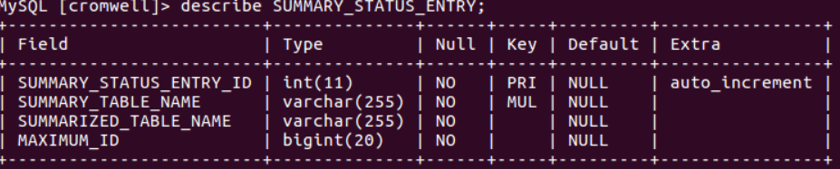
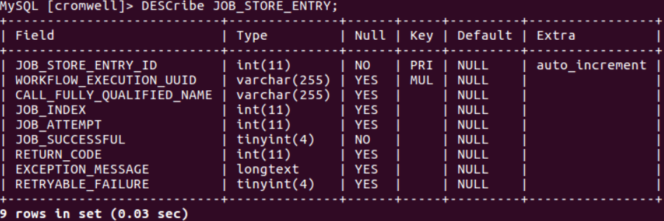
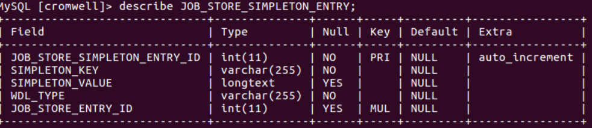
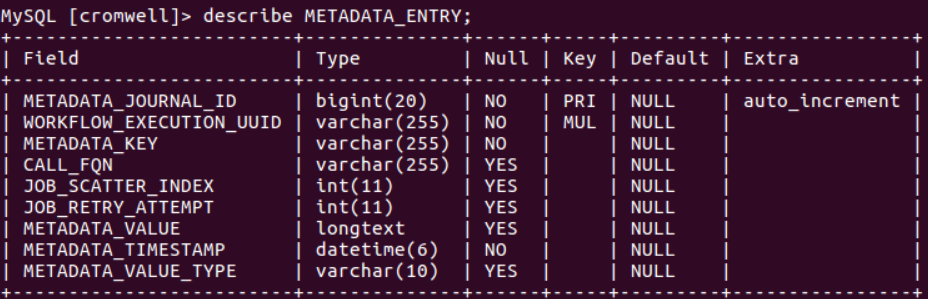
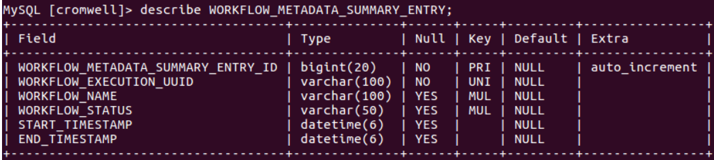
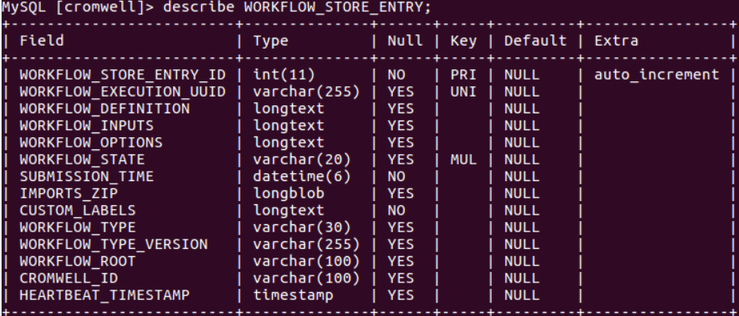

# Database Reference

## All tables

## Custom Labels

## Docker hash store

## Job Key Value

## Sub Workflow Store

## Summary Status

## Job Store

## Job Store Simpleton

## Metadata

## Workflow Metadata Summary

## Workflow Store

