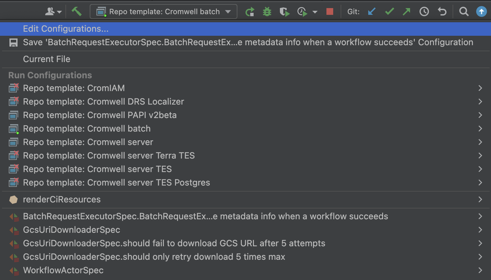
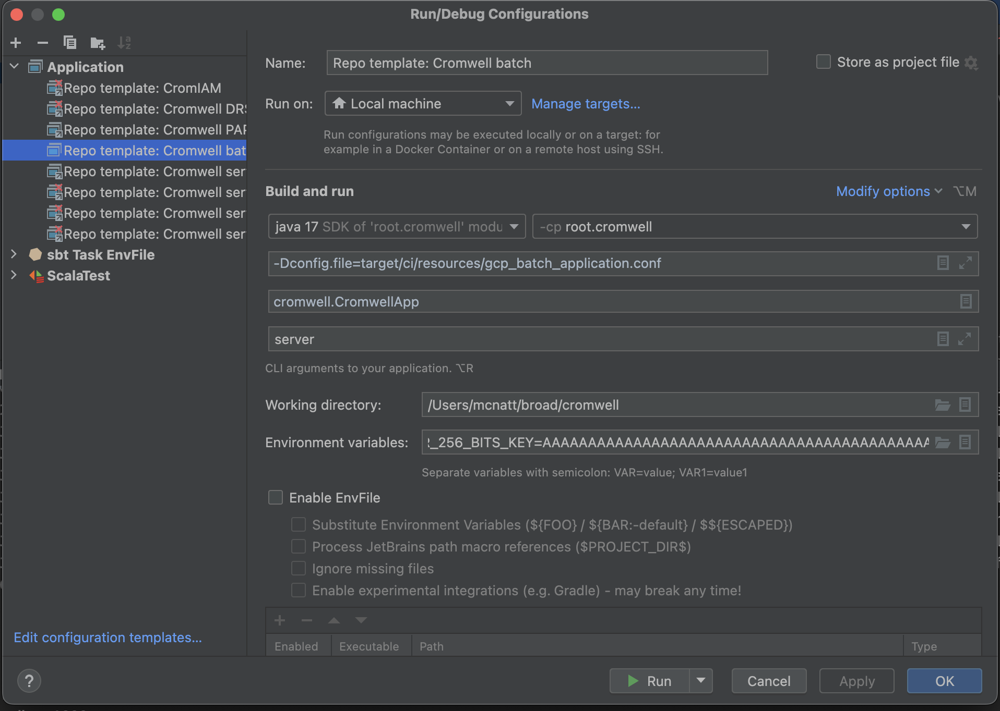

In order to run a Cromwell instance locally, there are the some prerequisites:
- Have docker and IntelliJ installed
- Start a local mysql instance by running `./scripts/local-docker-database/start_mysql_docker.sh`
- Run renderCiResources.sh to generate the configuration files

To run the backend locally, set up your preferred run configuration. 
More information on backends can be found [here](Backend.md)

If you've created a new config, you may need to edit your run configuration to point to the correct config file or edit the environment variables.
Example for batch:

Upon startup, the Cromwell swagger will be available at `http://localhost:8000`.
(You can change the port and other configurations by following [these instructions](../Configuring.md)

**Note**: To verify that workflows are being submitted to the correct backend, look for logs  with `Call-to-Backend assignments` and check that the tasks are being directed to `-> GCPBATCH`.