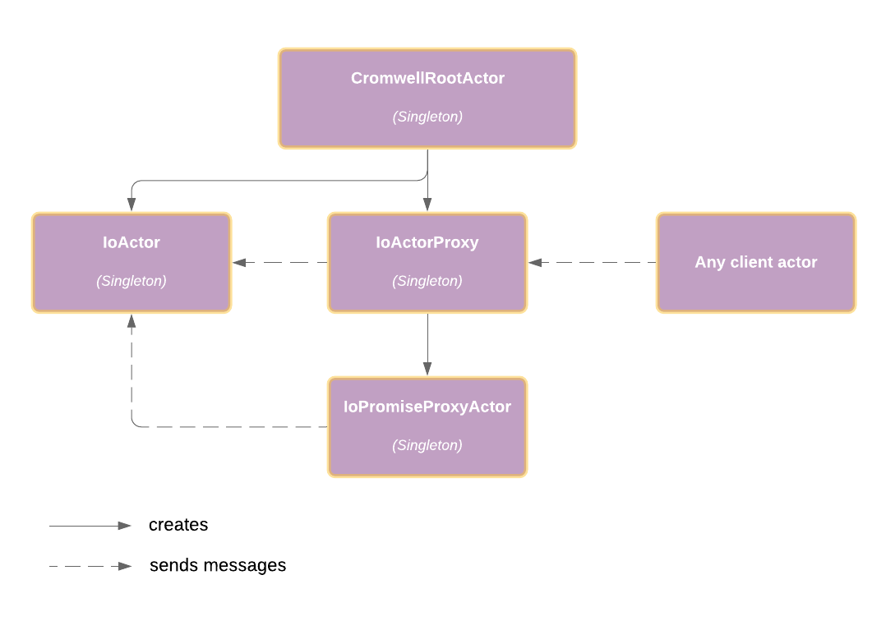
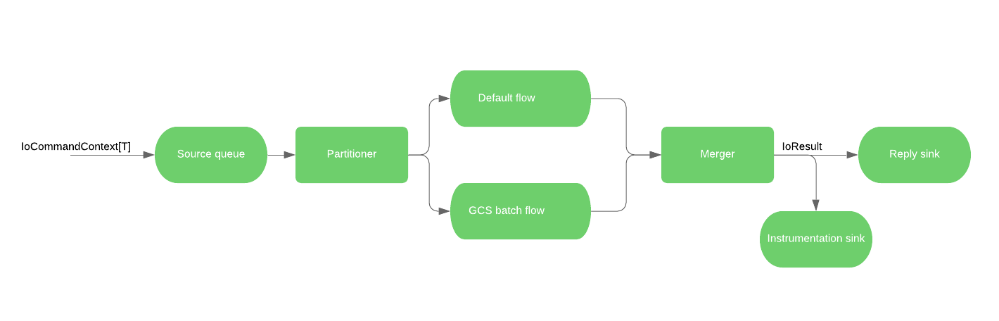

# IoActor: basic concepts

* **Word count:** 225

## Actor Hierarchy

IO subsystem consists of the following actors.

All messages are sent to `IoActorProxy`, which then routes them either to `IoActor` or `IoPromiseProxyActor` based on 
whether the message contains a Promise. `IoPromiseProxyActor` receives a message with Promise, forwards message to the 
`IoActor`, and once response from `IoActor` comes back, completes the promise.

`IoActor` has back-pressure (always enabled) and throttling (configurable) features implemented in order to prevent 
overflowing the incoming messages queue.

## Message types and processing logic

`IoActor` accepts messages of base type `IoCommand[T]` with or without clientContext (which is a Promise, which will be 
passed through, back to the `IoPromiseProxyActor` in the end)

Message processing logic is implemented using Akka Stream API and can be represented with the following graph:

There are 2 message processing flows:  
1. "GCS batch flow" to process messages, which are subtypes of `GcsBatchIoCommand`  
1. "Default flow" for all other subtypes of `IoCommand`
  
Both "GCS batch flow" and "Default flow" allow to configure desired parallelism level, which can be done during 
`IoActor's` creation using `gcsParallelism` and `nioParallelism` parameters respectively. 
The particular implementation logic for each base IO command is encapsulated inside `ParallelGcsBatchFlow` and 
`NioFlow` classes.

The final `IoResult` is sent both to the "reply sink" which is responsible for sending result to the original sender, and 
"instrumentation sink", which is responsible for sending `InstrumentationServiceMessage` to the `ServiceRegistryActor`  
