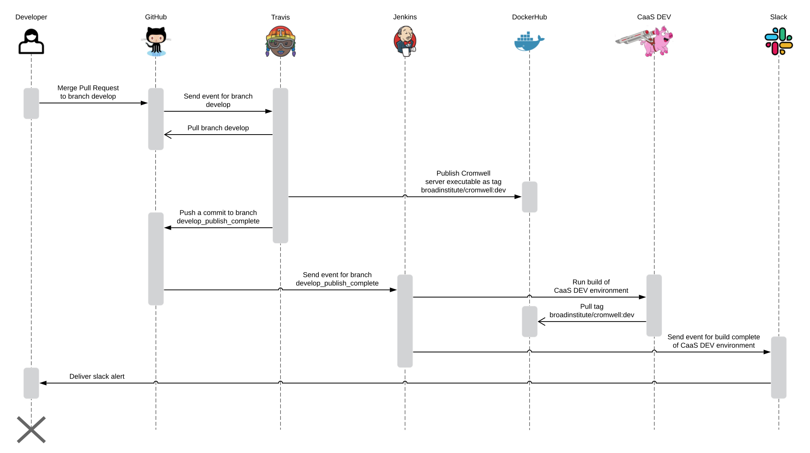
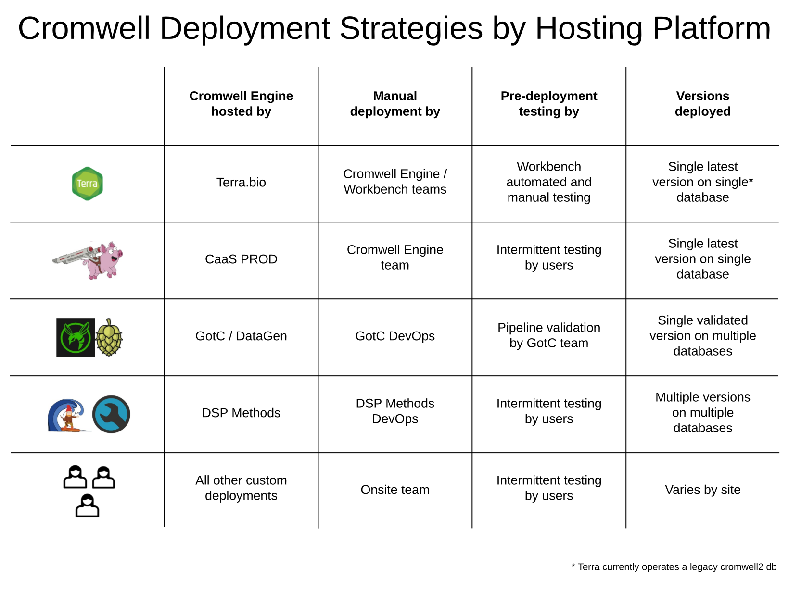

Cromwell uses [Continuous Integration](https://en.wikipedia.org/wiki/Continuous_integration) (CI) testing, along with [Continuous Delivery](https://en.wikipedia.org/wiki/Continuous_delivery) (CD) to the Cromwell-as-a-Service (CaaS) `DEV` environment. [Continuous Deployment](https://en.wikipedia.org/wiki/Continuous_deployment) is not implemented.

## CI testing in Travis and Jenkins

Any suite of tests running under 2.5 hours, using 2 cpus, and 6gb of memory executes on [Travis](https://travis-ci.com/broadinstitute/cromwell/). Travis tests every pull request by a trusted contributor. Larger test suites run on [Jenkins instances](https://github.com/broadinstitute/dsp-jenkins#readme). Examples include the DSP Workbench CI testing ([swatomation](https://fc-jenkins.dsp-techops.broadinstitute.org/job/swatomation-pipeline/)), a nightly test of `develop` on (a snapshot of) the [$5 Genome WDL](https://gotc-jenkins.dsp-techops.broadinstitute.org/job/cromwell-cron-aws/), and the [Cromwell-Perf tests](https://fc-jenkins.dsp-techops.broadinstitute.org/job/cromwell-perf-cron/) that call-cache thousands of jobs.

## CD to CaaS DEV

One instance utilizing continuous delivery is the `develop` branch to CaaS `DEV`. While manual testing could occur on `DEV`, users primarily test on `PROD`.

## Manual Deployments

 
The Cromwell developers stage Terra and CaaS `PROD` deployments. All other deployments are performed by respective groups, who decide when and how to redeploy. Some upgrade Cromwell, while others deploy completely new instances, including a new database schema.

## Code Coverage

Only Travis Pull Requests generate [maximal code coverage reports](https://codecov.io/gh/broadinstitute/cromwell/pulls). All other CI either doesn't report coverage, or under-reports due to skipped tests.

## Vulnerability Scanning

In collaboration with the DSP Information Security team, scans include but are not limited to:

- Committed Git secrets
- Vulnerable Java dependencies
- Penetration testing
