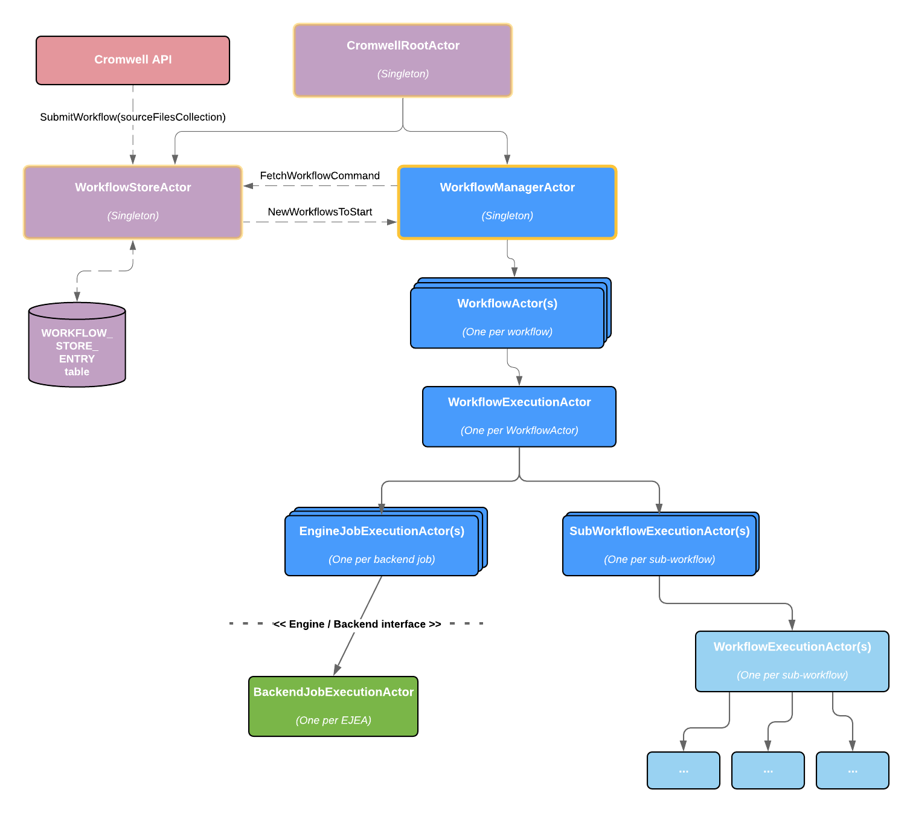

# Workflow Execution: Major Actors

* **Bitesize Documentation:** Covering the main actors involved in workflow execution.
* **Word Count:** 195

## High Level Overview

## Actors and their Purposes

### WorkflowManagerActor

The `WorkflowManagerActor` is responsible for:

* Polling the `WorkflowStore` at pre-configured intervals.
* Starting new workflows
* Tracking, supervising and aborting running workflows
* Parent actor for all `WorkflowActor`s

### WorkflowActor(s)

Each `WorkflowActor` is responsible for:

* Running a single workflow.
* Starting jobs and sub-workflows as soon as they are able to run.
    * Based on values in the (in-memory) ValueStore and ExecutionStore objects.
* Parent actor for all `EngineJobExecutionActor`s and `SubWorkflowExecutionActor`s.

### EngineJobExecutionActor(s)

Each `EngineJobExecutionActor` (EJEA) is responsible for:

* Running a single job.
    * A "job" is a command line instruction to run on a backend.
    * Multiple shards for a single call each get their own EJEA.
    * Multiple attempts to run the same job operate within the same EJEA
* Respects hog-limiting
* Checks the call cache and job store to avoid running the job if it doesn't have to.
* Triggers job initialization, execution and finalization at appropriate times.

### SubWorkflowExecutionActor(s)

Each `SubWorkflowExecutionActor` is responsible for:

* Running a single sub-workflow.
* Parent actor for the `WorkflowActor` created to run the sub-workflow.

## See Also 

* EngineJobExecutionActor (**TODO**)
* Backend Execution Actors (**TODO**)
