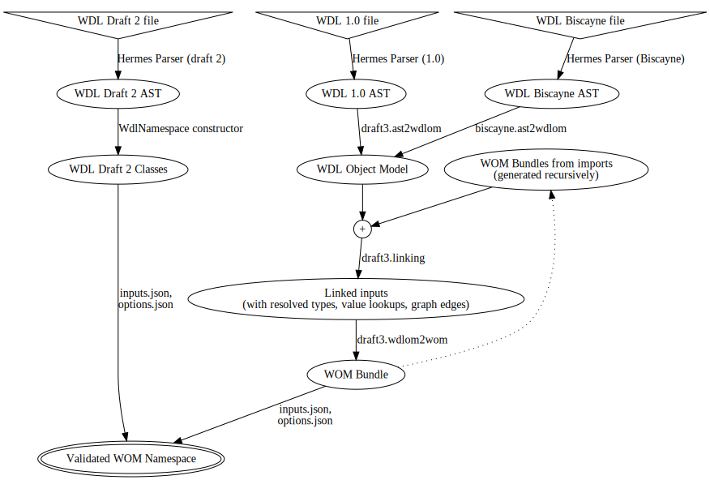

### WDL File to WOM Conversion

#### Parsing Flowchart

For the various version of WDL supported in Cromwell, the conversion to WOM follows
these paths: 

#### Process Description

You can think of WDL parsing in Cromwell in terms of the following major steps:

1. Lexing: Converting the raw WDL string into a 1D stream of "tokens".
2. Parsing: Converting the stream of tokens into an abstract syntax tree (AST).
3. Transliteration: Transforming the language-specific AST into a standard set of scala objects
4. Import Resolution: Recursively processing any import statements into WOM bundles.
5. Linking: Discovering, resolving and recording all references within the AST and imports.
6. WOM Building: Creating a set of WOM objects
7. Input Validation: Link any provided inputs to inputs on the WOM objects.

#### Intermediate Data Formats

* **WDL Object Model (WDLOM)**:
    * A scala case class representation of WDL grammar ASTs.
* **Linked inputs**:
    * The original file's WDLOM representation
    * And WOM bundles imported
    * Links from any references to their definitions
        * Including custom type references, variable references, task calls, subworkflow calls 
* **WOM Bundle**:
    * A set of tasks, workflows and custom types, and the fully qualified names by which they can be referenced.
    * In Cromwell's WOM format (the WOM format is the ultimate destination for _all_ languages, including WDL and CWL)
* **Validated WOM Namespace**:
    * The conjunction of a WOM bundle with an input set.
    * The entry point workflow (or sometimes task, in CWL) is known.
