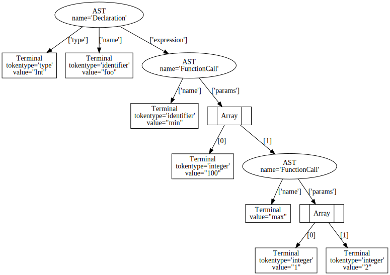
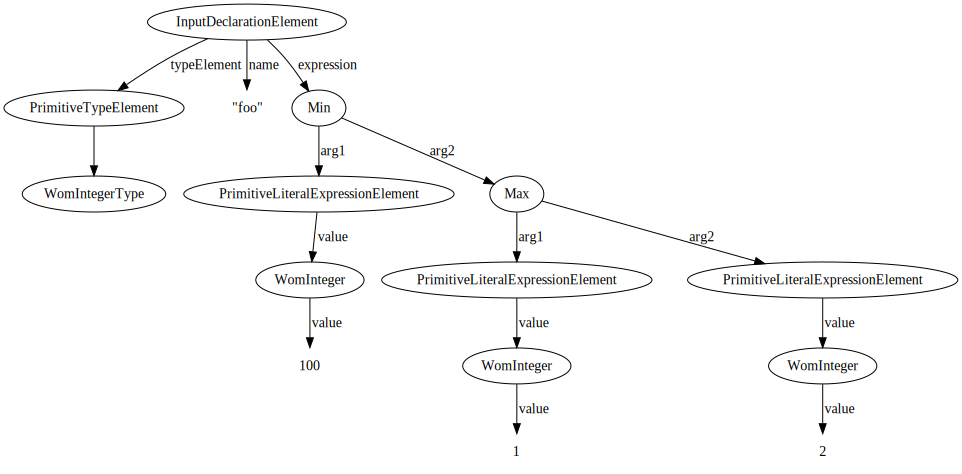

### Converting WDL into WDLOM

To provide a concrete example, we will see how Cromwell parses the following line of WDL into WDLOM:

```wdl
Int foo = min(100, max(1,2))
``` 

#### How Hermes interprets the WDL

Hermes can be asked to show its parse tree for a valid WDL file by running:

```bash
$ hermes analyze grammar.hgr <WDL FILE>
```

This allows us to see how Hermes interprets our line of WDL:

```
(Declaration:
  type=<string:5:5 type "SW50">,
  name=<string:5:9 identifier "Zl9yb3VuZA==">,
  expression=(FunctionCall:
    name=<string:5:19 identifier "bWlu">,
    params=[
      <string:5:23 integer "MTAw">,
      (FunctionCall:
        name=<string:5:28 identifier "bWF4">,
        params=[
          <string:5:32 integer "MQ==">,
          <string:5:34 integer "Mg==">
        ]
      )
    ]
  )
)
```

In graphical form this is (with string hashes replaced by values, for convenience):



#### How WDLOM represents WDL

WDLOM tries to be a programmer-friendlier, WDL version agnostic data model to hold WDL syntax trees.

It would use the following data structure to represent this declaration:

```scala
InputDeclarationElement(
    typeElement = PrimitiveTypeElement(WomIntegerType),
    name = "foo",
    expression = Min(
        arg1 = PrimitiveLiteralExpressionElement(WomInteger(100)),
        arg2 = Max(
            arg1 = PrimitiveLiteralExpressionElement(WomInteger(1)),
            arg2 = PrimitiveLiteralExpressionElement(WomInteger(2))
        )
    )
)
```

Again, attempting to show this graphically:



#### Transliteration functions from Hermes ASTs to WDLOM

The various classes in the `wdl.transforms.base.ast2wdlom` package implement conversions from various types of AST element into various types of WDLOM.

Let's look at [`AstToInputDeclarationElement`](https://github.com/broadinstitute/cromwell/blob/master/wdl/transforms/new-base/src/main/scala/wdl/transforms/base/ast2wdlom/AstToInputDeclarationElement.scala):

* The conversion from AST to WDLOM relies on two other conversions, `astNodeToTypeElement` and `astNodeToExpressionElement`, 
to validate the attributes on the AST it is given, and construct WDLOM from Hermes ASTs.
* The resulting function can itself be used as a building block to construct higher-level WDLOM types. 

#### How AST-to-WDLOM building blocks are chained together

To see how these building blocks are pieced together we can look at WDL 1.0's [`ast2wdlom`](https://github.com/broadinstitute/cromwell/blob/master/wdl/transforms/draft3/src/main/scala/wdl/draft3/transforms/ast2wdlom/ast2wdlom.scala)  package object.

Notice how - and where - the `astToInputDeclarationElement` value is declared:

* It follows the `implicit val`s `astNodeToTypeElement` and `astNodeToExpressionElement` and so can use those in its processing.
* It is, as an `implicit val`, used later on by `astNodeToInputsSectionElement`, which is then used by `astNodeToWorkflowBodyElement` and `astNodeToTaskSectionElement`, and so on. 

#### How different WDL versions convert to WDLOM differently

These package objects ultimately control how different WDL versions are parsed differently. These differences can be seen most easily by comparing package objects for different WDL versions:

```bash
diff \
  wdl/transforms/draft3/src/main/scala/wdl/draft3/transforms/ast2wdlom/ast2wdlom.scala \
  wdl/transforms/biscayne/src/main/scala/wdl/transforms/biscayne/ast2wdlom/ast2wdlom.scala   
``` 

In an extreme case, these could contain fundamentally different conversion logic from AST to WDLOM for different WDL versions. Luckily, between
WDL 1.0 and the WDL `development` version, there are only a few minor changes, amongst which are:

* Importing a new Hermes parser.
* Specifying that additional functions are available when constructing the `astNodeToExpressionElement` conversion.
* Specifying that a new `Directory` type is available when constructing the `astNodeToTypeElement` conversion.
