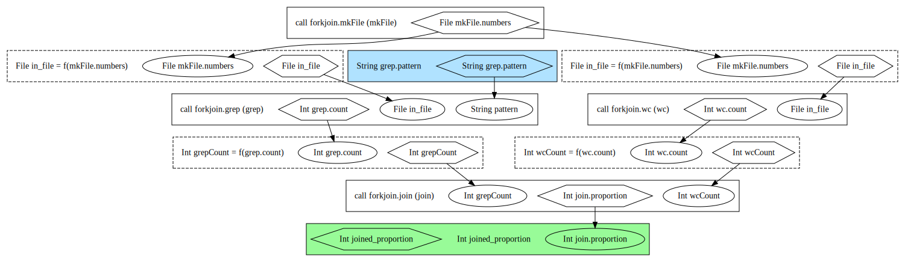

### Intro to Workflow Object Model

"WOM" is the acronym for the Workflow Object Model, living in the `wom` package. WOM is a directed acyclic graph that captures workflow inputs, outputs, calls, and the dependencies between them.

Examine the workflow below, making note of how the outputs of early calls become inputs for later calls. The first example is the `numbers` output of the `mkFile` call serving as the `in_file` input to the `grep` call. 
```
version 1.0

##
# Checks a simple branch and join operation.
# We start with a task, branch into two parallel executions, and then rejoin to calculate the result.
##

workflow forkjoin {
  call mkFile

  call grep { input: in_file = mkFile.numbers }
  call wc { input: in_file=mkFile.numbers }

  call join { input: wcCount = wc.count, grepCount = grep.count }

  output {
    Int joined_proportion = join.proportion
  }
}

task mkFile {
  command <<<
    for i in `seq 1 1000`
    do
      echo $i
    done
  >>>
  output {
    File numbers = stdout()
  }
  runtime {docker: "ubuntu:latest"}
}

task grep {
  input {
    String pattern
    File in_file
  }
  command <<<
    [ -f "~{in_file}" ] && grep '~{pattern}' ~{in_file} | wc -l
  >>>
  output {
    Int count = read_int(stdout())
  }
  runtime {docker: "ubuntu:latest"}
}

task wc {
  input {
    File in_file
  }
  command <<<
    [ -f "~{in_file}" ] && cat ~{in_file} | wc -l
  >>>
  output {
    Int count = read_int(stdout())
  }
  runtime {docker: "ubuntu:latest"}
}

task join {
  input {
    Int grepCount
    Int wcCount
  }
  command <<<
    expr ~{wcCount} / ~{grepCount}
  >>>
  output {
    Int proportion = read_int(stdout())
  }
  runtime {docker: "ubuntu:latest"}
}
```  

Now, compare the workflow source to its WOM graph (generated with the `womtool womgraph` command).



Input values are ovals, outputs are hexagons. You can see that a hexagon in one node (call) becomes an oval in the next. 

The `grep` call is special because one of its two inputs, `pattern`, is not specified by any previous call within the bounds of the graph. This causes Cromwell to generate a blue "external graph input node" (`wom.graph.ExternalGraphInputNode` if you're looking at the code). Its value must be specified by the user in the inputs file of the workflow under key `grep.pattern`, and Cromwell will pass it into the `grep` call.   

Finally, the `proportion` output of the `join` call is piped out of the bounds of the workflow graph by becoming the green `joined_proportion` graph output node (`wom.graph.ExpressionBasedGraphOutputNode` in the code). 

Graph nodes inherit from trait `wom.graph.GraphNode`. The graph is constructed in class `wdl.transforms.base.wdlom2wom.WorkflowDefinitionElementToWomWorkflowDefinition`. The `convertGraphElements` function is especially interesting. It accepts a `Set` of `WorkflowGraphElement` objects, which represent individual pieces of the parsed workflow, and converts them to WOM nodes. Then it links the WOM nodes together with edges and emits the finished graph as a `wom.graph.Graph`.
