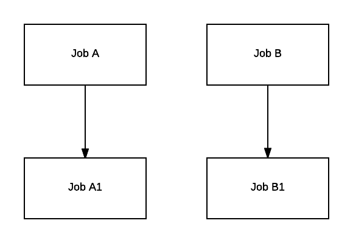
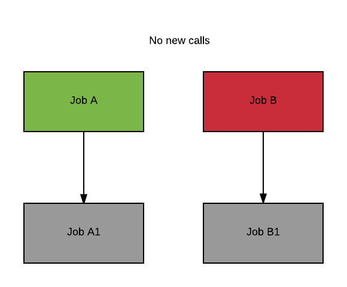
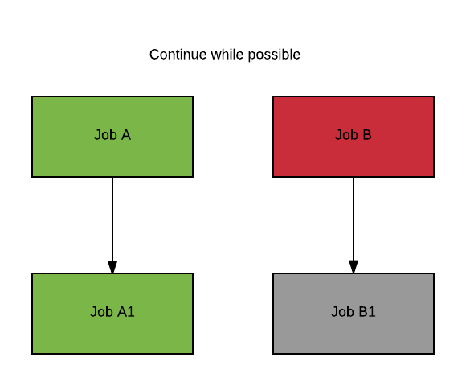
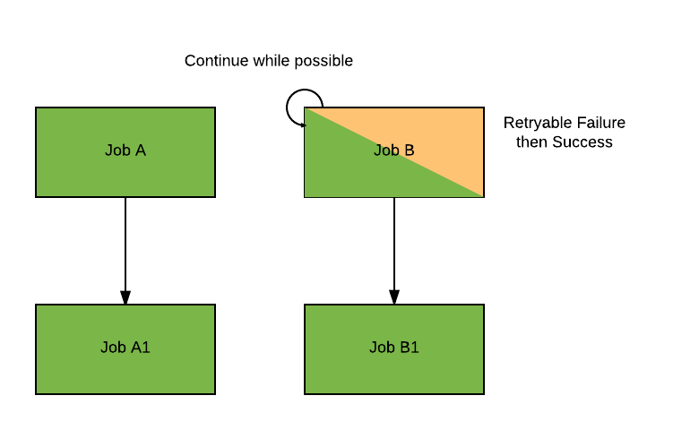
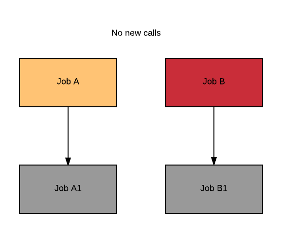
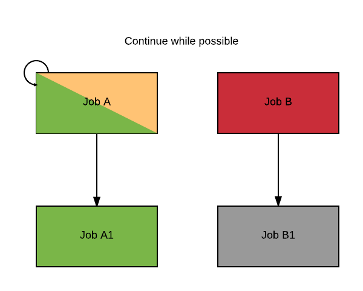
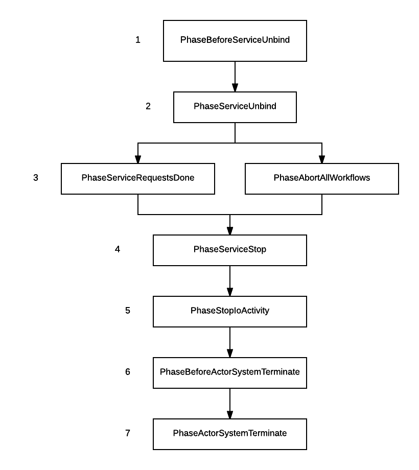

In order to run a workflow, Cromwell uses the backends available to it to create jobs and monitor them until they are complete. When no new jobs can start and all jobs have finished (Success, Failure, Aborted), the workflow terminates.

In an ideal situation, all jobs succeed and the workflow succeeds.
Unfortunately things don't always go as planned. Here is what to expect from Cromwell when things go off the rails.

## Failure Modes

Cromwell supports two failure modes, which specify how Cromwell behaves when a job fails during the execution of a workflow.

* `NoNewCalls` **(default)**  
	* Cromwell does not start any new call as soon as a job fails. Cromwell will still monitor the rest of the jobs until they complete (successfully or not).  
* `ContinueWhilePossible`  
	* Cromwell attempts to run as many jobs as possible until no more can be started. When all running jobs are complete, the workflow fails.

The failure mode can be set in the [Configuration](../Configuring/) or [Workflow Options](../wf_options/Overview#workflow-failure).

_For example:_

This simple diagram represents 4 jobs:

* Job A and Job B are independent; 
* Job A1 depends on A; 
* Job B1 depends on B.

Let's look at the case where A and B are both running, and for some reason B fails (shaded red).

**`NoNewCalls`**  
If the failure mode is `NoNewCalls` Cromwell waits for A to complete (shaded green). Regardless of whether A is successful or not, Cromwell then fails the workflow, without starting A1 or B1 (shaded grey).

**`ContinueWhilePossible`**  
If the failure mode is `ContinueWhilePossible` and A succeeds (green), then Cromwell starts A1 (green) and waits for it to complete. At this point all jobs that can run have completed. B1 (grey) cannot run since B failed (red), therefore Cromwell fails the workflow without starting B1.

### Retryable failures

Retryable failures are **not** failures that can trigger a workflow failure. An example of a retryable failure is when a [preemptible VM](../RuntimeAttributes/#preemptible) is preempted. 

In the example above, if B's failure is retryable then B will be retried (shaded yellow and green). The workflow will keep running normally, regardless of which failure mode is enabled.

Using the previous example, let's imagine **B** failed from a **non-retryable** failure (shaded red). After B failed, **A** fails from a **retryable** failure. Now Cromwell's behavior will depend on the failure mode.

**`NoNewCalls`**  
If the failure mode is `NoNewCalls`, then A **will not be** retried (yellow). A1 (grey) will not start, because A did not complete.

**`ContinueWhilePossible`**  
If the failure mode is **`ContinueWhilePossible`**, then A **will be** retried (yellow and green). If A is successful then A1 will start (green).

## Abort

In both [Run](../Modes/#run) and [Server](../Modes/#server) mode, you can abort a running workflow. This section explains what that entails.

When aborting a workflow, either through the [abort endpoint](../api/RESTAPI#abort-a-running-workflow) or by terminating the [Cromwell run process](../Modes) (if [configured](../Configuring#abort) to do so), Cromwell does the following:

1. Changes the status of the workflow to `Aborting`,
2. Does not start any new jobs,
3. Asks every running job to abort,
4. Waits for all running jobs to complete,
5. Finalizes the workflow,
6. Changes the status of the workflow to `Aborted`.

The action of aborting a job is backend specific. Cromwell can only ask a backend to abort a job and wait for the backend to notify it when it is aborted.  

For example, if you are running Cromwell on the Google backend and abort a job, Google will send an abort request to the Google Pipelines API. When Pipelines API indicates that the status of the job is aborted, Cromwell will mark it as such.
Remember that abort action is entirely dependent on the backend. In this particular case, Pipelines API does not guarantee the success of an abort request (see [Pipelines API documentation on abort](https://cloud.google.com/genomics/reference/rest/v1alpha2/operations/cancel)).

You'll also notice that the workflow is finalized even though being aborted.
Finalization is the last step in the execution of a workflow and a chance for each backend to do some work before the workflow is terminated.
Backends won't be denied the chance to finalize the workflow even if it's being aborted.

_Note that by the time the backend is asked to abort a job, the job may have succeeded or failed already. In this case Cromwell will report the job's status (successful or failed)._

_If a job fails with a retryable failure (e.g is preempted), it will **not** be attempted again when the workflow is aborting._

## Restart

When Cromwell restarts (for example to upgrade to a new version) it will reconnect to all workflows that were in progress. On the Google and HPC backends only, Cromwell will additionally attempt to reconnect to all running jobs. Note that a workflow
does not "belong" to any one Cromwell instance (it belongs to the cluster), so a different instance in a horizontal cluster might reconnect to the workflow instead of the original.

If the workflow was in state `Aborting`, Cromwell will ask all running jobs to abort again. No new jobs will be started.

Once all jobs have been reconnected to, the workflow will keep running normally.

During the reconnection process Cromwell might ask backends to reconnect to jobs that were never started before the restart. In that case, the job will be mark as failed with an explanation message. This failure is benign and only an artifact of the fact that Cromwell was restarted.  
If the backend does not support reconnection to an existing job, jobs will be marked as failed with an explanation message as well. The backend status of the jobs will be "Unknown".

## Graceful Shutdown

When Cromwell is run as a server, it will by default attempt to gracefully shutdown, stopping its different services in a specific order to avoid losing critical data.
This behavior, documented below, can be turned off in the configuration via `system.graceful-server-shutdown = false`.

Upon receiving a `SIGINT` or `SIGTERM` signal, the JVM will initiate its shutdown process. Prior to this Cromwell will attempt to shutdown its own services in the following way:

1. Workflows in `Submitted` state are no longer started
2. Cromwell unbinds from the address/port it was listening on. From this point the Cromwell server is unreachable via the endpoints.
3. All actors generating data that needs to be persisted receive a message asking them to gracefully stop.
This means that they are given some time (see below for how much and how to change it) to return to a known "consistent" state.
For example, an actor waiting for a response from the database before sending information to the metadata will wait for that response before shutting itself down.
4. All active connections from the REST endpoints are completed and closed. At this point any client that made a request before the shutdown process started should have received a response.
5. All actors responsible for data persistence are in turn being asked to gracefully shutdown. 
For example, all queued up metadata writes are executed.
6. Database connection pools are shutdown.
7. Actor system shuts down.
8. JVM exits.
    
This multi-stage process is designed to minimize the risk of data loss during shutdown. However in order to prevent this process from lasting forever, each stage (called phase) has its own timeout.
If the phase does not complete within the given timeout, actors will be forcefully stopped and the next phase will start.

This logic is implemented using [Akka Coordinated Shutdown Extension](http://doc.akka.io/docs/akka/current/scala/actors.html#coordinated-shutdown). Currently Cromwell is running [version 2.5.4](https://doc.akka.io/docs/akka/2.5.4/scala/actors.html#coordinated-shutdown).
It comes with a set of pre-defined phases, that can be added on and modified. Those phases can be linked together to form a Graph. Cromwell shutdown graphs looks as such:

Pre-defined but unused phases have been omitted (cluster related phases for example that are irrelevant in Cromwell).

You'll notice the presence of a `PhaseAbortAllWorkflows` phase. This phase is at the same level as the `PhaseServiceRequestsDone` phase which corresponds to our step #3 above.
The reason for a specific abort phase is so that its timeout can be configured differently than the normal shutdown phase.

Indeed, stopping all workflows and aborting them is very similar from an outside perspective. We send a message (resp. "Stop" and "Abort") and wait for a response.

In the case where you want to be able to give more time to abort, as it will likely involve more work, you can edit the value of `coordinated-shutdown.phases.abort-all-workflows.timeout` which defaults to 1 hour.
Phases timeouts default to 5 seconds, except the stop-io-activity phase which defaults to 30 minutes. This is because depending on the Database load at the time of the shutdown, it might take a significant amount of time to flush all pending writes.

All of the timeouts are configurable in the `akka.coordinated-shutdown.phases` section ([see the latest `reference.conf`](https://raw.githubusercontent.com/akka/akka/master/akka-actor/src/main/resources/reference.conf)).
To change the default timeout, change the value of `akka.coordinated-shutdown.default-phase-timeout`.
