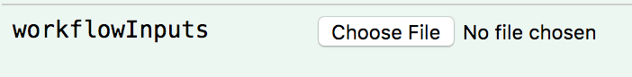

# Server Mode

Cromwell is best experienced in "server" mode, as discussed in the [Modes section of the docs](../Modes).

# Prerequisites

This tutorial page relies on completing the previous tutorials:

* [Five Minute Introduction](FiveMinuteIntro.md)

# Goals

At the end of this tutorial you'll have run Cromwell in Server Mode, allowing you to submit more than one workflow in parallel, and query workflows even after they have completed.

# Prepare Files

Paste the following into  a file called `hello.wdl`:
```wdl
task hello {
  String name

  command {
    echo 'Hello ${name}!'
  }
  output {
    File response = stdout()
  }
}

workflow test {
  call hello
}
```

Paste the following into a file called `inputs.json`:
```json
{
  "test.hello.name": "World"
}
```

# Run the server

1. Run `java -jar cromwell-[version].jar server` (replace [version] with actual version).  Note that there is a `server` argument, this is the special sauce!
2. Visit <a href="http://localhost:8000">localhost:8000</a> in your browser

# Start the job

1. Navigate to Workflows section and click "Show/Hide"  

2. Navigate to `/workflows/{version}` which has a green "POST" on the left.  

3. Find workflowSource file, "Choose File" and navigate to `hello.wdl`.  
  
4. Find inputs file and navigate to `inputs.json`.  
  
5. Navigate to the bottom of this section and click "Try it out!"  

6. Observe output from the server process.

# What happened?

* [Did it work?  Check the status endpoint](../api/RESTAPI#api-workflows-version-id-status-get)
* Holy logs!  [How can I just see my outputs?](../api/RESTAPI#api-workflows-version-id-outputs-get)
* [Check out metadata related to your workflow.](../api/RESTAPI#api-workflows-version-id-metadata-get)
* [All kinds of other interesting info.](../api/RESTAPI)

### Next Steps

Nice job! Now that you have cromwell running in server mode you've reached the upper echilons of Cromwell prowess! After reaching these dizzy heights, you might also find the following pages interesting:

* [Viewing Metadata](MetadataEndpoint)
* [Timing Diagrams](TimingDiagrams)
* [Configuration Files](ConfigurationFiles)
