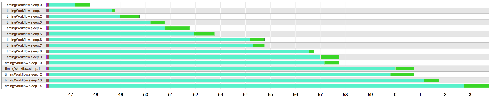

## Timing Diagrams

### Prerequisites

This tutorial page relies on completing the previous tutorials:

* [Server Mode](ServerMode)

### Goals

At the end of this tutorial you'll have seen how to view timing diagram for a workflow as it's running, and interpreting the information on the timing diagram for a completed workflow.

### Let's get started

Want to see the tasks that ran in your workflow laid out in a handy timing diagram? Good news! That's exactly what's about to happen to you!

#### Preparing files

To get a good example of these timing diagrams, we're going to make a workflow that scatters a task across a few indices, and see how that gets represented. Open your favorite text editor, copy the following text in and save it in your cromwell directory as `timingWorkflow.wdl`:
```wdl
workflow timingWorkflow {
	scatter(i in range(15)) {
		call sleep { input: sleep_time = i }
	}
}

task sleep {
	Int sleep_time
	command {
		echo "I slept for ${sleep_time}"
		sleep ${sleep_time}
	}
	output {
		String out = read_string(stdout())
	}
}
```

In brief, this workflow will scatter 15 tasks, each one will sleep for a time proportional to their scatter index. Is that hard to imagine? Never mind, we'll see it in diagramatic form soon!

#### Submit to cromwell:

If it's not running already, start the cromwell server:
```sh
java -jar cromwell-29.jar server
```

Submit the workflow:
```sh
curl -X POST --header "Accept: application/json"\
	-v "localhost:8000/api/workflows/v1" \
	-F workflowSource=@timingWorkflow.wdl
```

Amongst the curl output you should see the workflow ID come back, eg:
```
[...] Workflow 8d18b845-7143-4f35-9543-1977383b7d2f submitted.
```

I can now enter the following address into my web browser (i.e. Chrome) and see the timing diagram for the workflow. You'll need to swap out my workflow ID for the one that you received (they're all randomly generated) 
```
http://localhost:8000/api/workflows/v1/8d18b845-7143-4f35-9543-1977383b7d2f/timing
```

Once your tasks complete you should see output like mine, displayed below:



### Next Steps

Nice work! Now you know how to investigate which tasks in your workflow are spending the most time, and which ones are holding up the rest of the workflow.
Perhaps after completing such an amazing feat you might find the following pages interesting:

* [Viewing Metadata](MetadataEndpoint)
* [Configuration Files](ConfigurationFiles)
