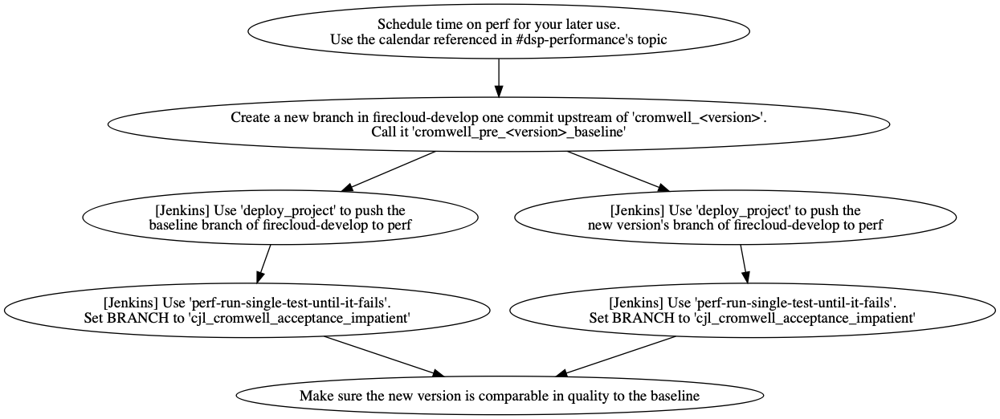

# Release Processes

## How to update these processes

Have a better idea about how the deployment processes should work? 
See our "updating the process" [process](../README.MD)!

## How to Publish Cromwell

 
 
## How to Release Cromwell into Firecloud

**Note:** How to accomplish some of these steps might be non-obvious to you. If so, refer to the additional details in the [full document](https://docs.google.com/document/d/1EEzwemE8IedCplIwL506fiqXr0262Pz4G0x6Cr6V-5E). 

 

## Performance Testing

This performance testing process happens as part of the release into FireCloud.

* **Note:** This process is non-blocking and optional for HOTFIX releases.
* **Note:** For now we will still let QA know that we are running a perf test for a Cromwell release. They might want to double-check that we did it right.

## How to Deploy Cromwell in CAAS prod

**Note:** Full details on how to complete each of these steps is found in the [Quick CAAS Deployment Guide](https://docs.google.com/document/d/1s0YC-oohJ7o-OGcgnH_-YBtIEKmLIPTRpG36yvWxUpE) 

