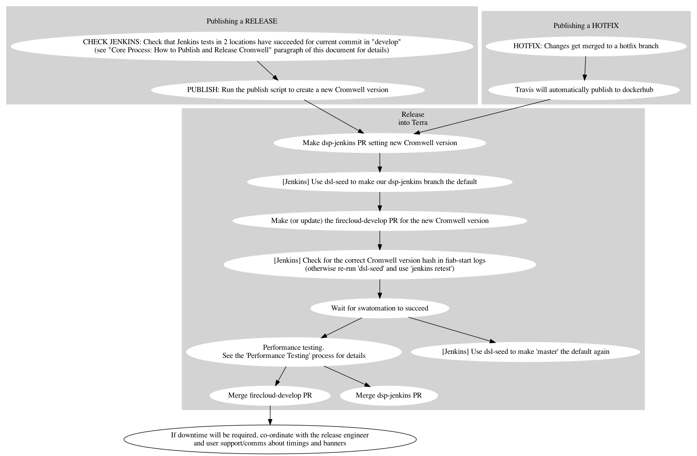
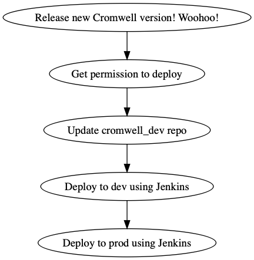

# Release Processes

## How to update these processes

Have a better idea about how the deployment processes should work? 
See our "updating the process" [process](../README.MD)!

## Core Process: How to Publish and Release Cromwell

If you're the lucky "Release Rotation Engineer" this time, you should do the following three things:

First: Run the publish script to create a new version of Cromwell.
Second: Run through the "How to Release Cromwell into Firecloud" process.
Third: Run through the "How to Deploy Cromwell in CAAS prod" process.
 
### How to Release Cromwell into Firecloud

**Note:** How to accomplish some of these steps might be non-obvious to you. If so, refer to the additional details in the [full document](https://docs.google.com/document/d/1EEzwemE8IedCplIwL506fiqXr0262Pz4G0x6Cr6V-5E). 

 

## Performance Testing

This performance testing process happens as part of the release into FireCloud.

* **Note:** This process is non-blocking and optional for HOTFIX releases.

1. Look at the [performance testing spreadsheet](https://docs.google.com/spreadsheets/d/1ksSHJdODuqqmvJ_94zZdc33Ai1Xv_53XzpsDd8jdmB0/edit#gid=479925276)
for any performance changes since the previous release.

2. A small amount of jitter is acceptable. So long as the lines are holding stable (or improving!), we consider Cromwell performance to not have regressed.

    * **Note:** If the spreadsheet is out of date, go to the testResults.tsv artifacts for recent runs of [Cromwell Perf: Limit Finder](https://fc-jenkins.dsp-techops.broadinstitute.org/job/cromwell-perf-limit-finder/)
runs and fill in any missing entries in the table.
 

### How to Deploy Cromwell in CAAS prod

**Note:** Full details on how to complete each of these steps is found in the [Quick CAAS Deployment Guide](https://docs.google.com/document/d/1s0YC-oohJ7o-OGcgnH_-YBtIEKmLIPTRpG36yvWxUpE) 



## Bonus Processes

The swagger client library is not part of our core publish/release process but can be performed from time to time, as required.

### How to Generate and Publish Swagger Client Library

The first step is to generate the client library.  From the root of the repo run

```
./scripts/gen_java_client.sh
```

This generates the client library and runs the generated tests as well.  A successful run should end with something similar to

```
[debug] Test run finished: 0 failed, 0 ignored, 7 total, 0.007s
[info] Passed: Total 103, Failed 0, Errors 0, Passed 100, Skipped 3
[success] Total time: 4 s, completed Jun 26, 2019 3:01:19 PM
```

To publish to artifactory, first obtain the artifactory username and credentials.  Then run

```
export ARTIFACTORY_USERNAME=<the-username>
export ARTIFACTORY_PASSWORD=<the-password>
./scripts/publish-client.sh
```
