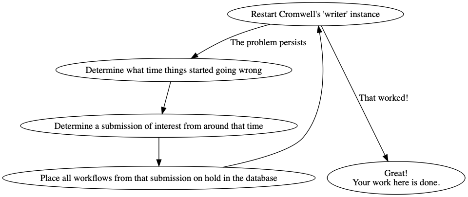

# Production Troubleshooting Processes

**Note:** These processes contain shorthand descriptions for various tasks.
If you aren't sure how to achieve any of these steps, look for the details in
the [Cromwell playbook](https://docs.google.com/document/d/1_iRESDzuCgPTOPJnTYxTncIqJU8B1IFWarypDe3gbCY).

## Cromwell's Patented All Purpose Magical Mess Remover

* Have you run through the end of the playbook suggestions and not found anything which fixes the issue?
* Do you just want the problem to go away so that you can get back to sleep as quickly as possible?

This is a (near-) foolproof series of steps to bring Cromwell back into a good state as quickly as possible if something weird is happening in Cromwell and you don't know why.

 
 
## How to update these processes

Have a better idea about how the troubleshooting processes should work? 
See our "updating the process" [process](../README.MD)!
