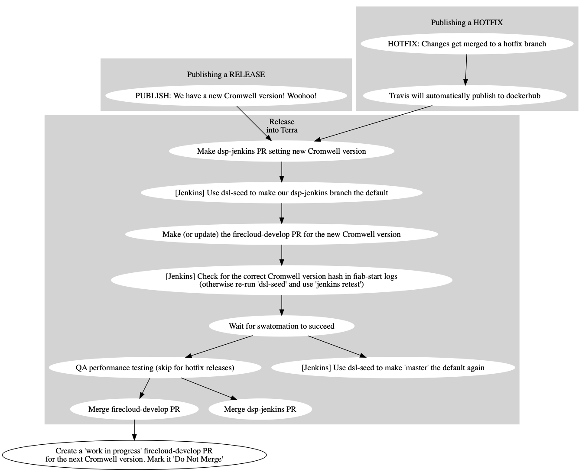
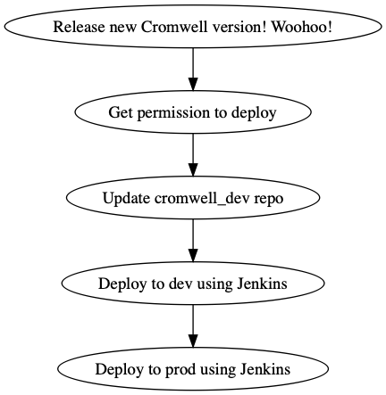

# Release Processes

## How to update these processes

Have a better idea about how the deployment process should go? Make a PR and it'll be reviewed, just like a code change!

 * Navigate to this directory
 * Modify the appropriate `.dot` file 
 * Run `refresh.sh` to update the png files.
 * Add and commit the changed `.dot` and `.png` files to git
 * The process changes undergo the same PR review as any other code or documentation change

## How to Release Cromwell

 
 
## How to Deploy Cromwell releases in Firecloud

 

## How to Deploy Cromwell in CAAS prod

