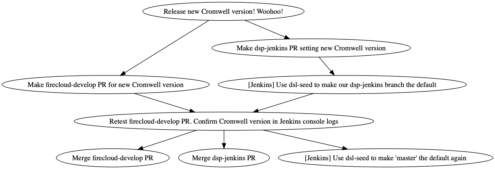

# Release Processes

## How to Release Cromwell

 
 
## How to Deploy Cromwell releases in Firecloud

 

## How to Deploy Cromwell hotfixes in Firecloud

* This is just like the main release, except we don't have to wait for a QA perf test, and thus
we don't have to iterate the swatomation runs.

## How to Deploy Cromwell in CAAS prod

## How to update these processes

Have a better idea about how the deployment process should go? Make a PR and it'll be reviewed, just like a code change!

 * Modify the appropriate `.dot` file in this directory.
 * Run `for i in $(ls *.dot); do dot -Tpng -o $i.png $i; done` to update all pngs.
 * Add and commit the changed `.dot` and `.png` files using git.
