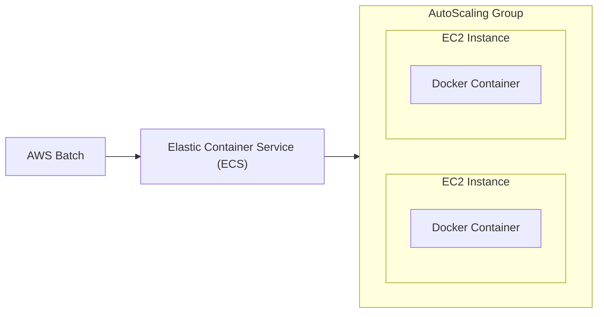
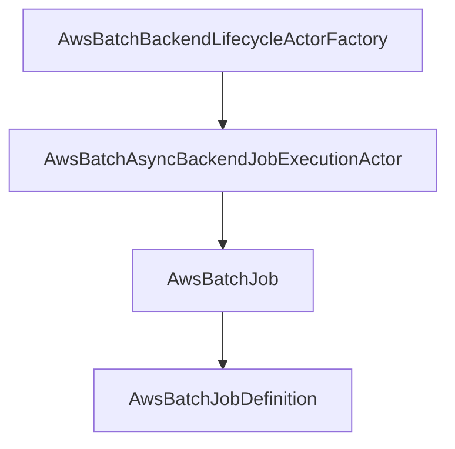
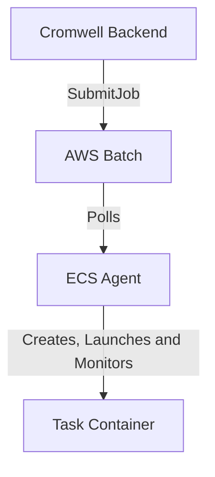
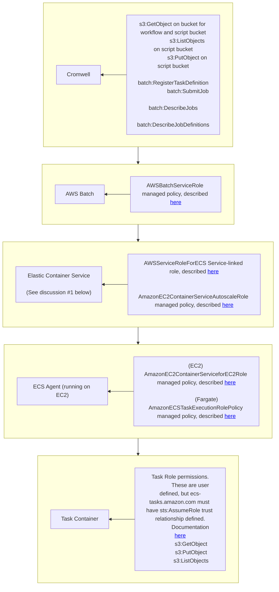

AWS Batch Backend Architecture
==============================

Overview
--------

The architecture of the code base follows very closely to the Google version.
Probably a little too closely, and lots of code was lifted from the Google
backend originally, then modified to work with AWS.

Fundamentally, Google Pipelines API (a.k.a. PAPI) works pretty differently from
AWS Batch. In Pipelines, all the infrastructure is completely managed by Google,
while AWS Batch exposes that infrastructure to a large degree so that customers
can fine tune it as necessary. An implementation that uses Fargate might be an 
alternative that is closer or an implementation that uses Step Functions although
that would be a separate backend.

From a Cromwell perspective, this means that unlike Pipelines, where
infrastructure details are defined in the configuration or the WDL, in AWS
Batch, these configuration details are handled outside. All the AWS Batch
backend needs to know is "what is the ARN for the job Queue"?

A good example of the difference can be seen in the 'disks' configuration. In
Pipelines, you need to specify the type of disk and size. In AWS, this will
be defined instead when you setup your environment (more on that later), so
all the AWS backend really needs to know is what mount points you need
defined.

This infrastructure and all the associated configuration still exists; however,
it is moved out of the Cromwell configuration.

Features
---------------------
### Docker Hub Authentication

Docker Hub authentication for AWS Backend enable users to access and use private Docker containers.

1. Create an access token in Docker Hub;
2. Encode the following string as base64: `<dockerhub-username>:<dockerhub-acess-token>`
3. Place the following snippet into `cromwell.conf` file under `config`:
```
dockerhub { token = "<enconded-string-from-point-2>" }
```

Stack must be deployed through https://github.com/aws-samples/aws-genomics-workflows.

### `awsBatchRetryAttempts`

*Default: _0_*

This runtime attribute adds support to [*AWS Batch Automated Job Retries*](https://docs.aws.amazon.com/batch/latest/userguide/job_retries.html) which makes it possible to tackle transient job failures. For example, if a task fails due to a timeout from accessing an external service, then this option helps re-run the failed the task without having to re-run the entire workflow. This option is also very useful when using SPOT instances.

It takes an Int, between 1 and 10, as a value that indicates the maximum number of times AWS Batch should retry a failed task. If the value 0 is passed, the [*Retry Strategy*](https://docs.aws.amazon.com/batch/latest/userguide/job_definition_parameters.html#retryStrategy) will not be added to the job definiton and the task will run just once.

This configuration should be passed in the `options.json` file when launching the pipeline.

```
runtime {
  awsBatchRetryAttempts: integer
}
```

### `ulimits`

*Default: _empty_*

A list of [`ulimits`](https://docs.aws.amazon.com/batch/latest/userguide/job_definition_parameters.html#containerProperties) values to set in the container. This parameter maps to `Ulimits` in the [Create a container](https://docs.docker.com/engine/api/v1.38/) section of the [Docker Remote API](https://docs.docker.com/engine/api/v1.38/) and the `--ulimit` option to [docker run](https://docs.docker.com/engine/reference/commandline/run/).

This configuration should be passed in the `options.json` file when launching the pipeline.

```
"ulimits": [
  {
    "name": string,
    "softLimit": integer,
    "hardLimit": integer
  }
  ...
]
```
Parameter description:

- `name`
  - The `type` of the `ulimit`.
  - Type: String
  - Required: Yes, when `ulimits` is used.

- `softLimit`
  - The soft limit for the `ulimit` type.
  - Type: Integer
  - Required: Yes, when `ulimits` is used.

- `hardLimit`
  - The hard limit for the `ulimit` type.
  - Type: Integer
  - Required: Yes, when `ulimits` is used.

### Call Caching with ECR private

AWS ECR is a private container registry, for which access can be regulated using IAM. Call caching is possible by setting up the following configuration:

1. Setup a user with pull-access to ECR, then use this role to run cromwell

profile default region must be setup in `~/.aws/config`: 
```
[profile MyECR-user]
region = eu-west-1
```
Provide the profile when launching cromwell:
```
AWS_PROFILE=MyECR-user java .... -jar cromwell.jar run .... 
```

Other methods to provide the profile might also work, but are not tested (Environment, roles, ...)

2. Enable call caching in the cromwell configuration

The following statement enable call caching, with "local" hash checking:

```
call-caching {
  enabled = true
  invalidate-bad-cache-results = true
}
docker {
   hash-lookup {
       method = "local"
   }
}
```

Notes:
- local hashing means that all used containers are pulled. Make sure you have enough storage
- enable a database to make the cache persistent over cromwell restarts

### Retry with more memory

Cromwell can be configured to retry jobs with more allocated memory, under a defined set of conditions. To enable this, set the following parameters:

cromwell configuration: `cromwell.config`:
```
// set the maximal amount of retries.
// backend.providers.AWSBatch.config.default-runtime-attribues.maxRetries
backend {
  providers {
    AWSBatch {
      config {
        default-runtime-attributes {
          maxRetries: 6 
        }
      }
    }
  }
}

// set the keys for Out-Of-Memory killing. 
// system.io.memory-retry-error-keys
system{
    io{
        memory-retry-error-keys = ["OutOfMemory","Killed"]
    }
}
```

Workflow specific runtime options : `workflow_options.json`:
```
{
    "memory_retry_multiplier" : 1.5
}
```

When providing the options.json file during workflow submission, jobs that were terminated due to insufficient memory will be retried 6 times, with increasing memory allocation. For example 4Gb => 6Gb => 9Gb => 13.5Gb => ... 

Note: Retries of jobs using the `awsBatchRetryAttempts` counter do *not* increase memory allocation. 

### Multipart copy settings

Multipart copying is a technology to increase upload performance by splitting the file in parallel processes. The awscli client does this automatically for all files over 8Mb. If a file was uploaded using MultiPart uploads, this is reflected in the ETAG value by a trailing '-\d+', where '\d+' reflects the number of parts. 

Cromwell uses a default threshold of 5Gb for multipart copying during cache-copy processes, and tries to create as much parts as possible (minimal size 5Mb, max parts 10K). Although the default settings are fine, this threshold can be adjusted to reflect ETAG-expectations in for examples upstream/downstream applications. If the treshold changes, the ETAGs will differ after copying the data. 

s3 multipart specific options: `cromwell.config`:
```
// activate s3 as a supported filesystem
engine {
  filesystems {
    s3 {
        auth = "default",
        enabled: true,
        # at what size should we start using multipart uploads ?
        MultipartThreshold = "4G",
        # multipart copying threads : if you set this number to a larger value then ensure the HttpClient has sufficient
        #   maxConnections (see org.lerch.s3fsAmazonS3Factory.getHttpClient). Default : 500
        threads = 50
    }
  }
}
```

### Metadata notifications

Cromwell has a feature that allows it to send metadata notifications to you. These notifications are mostly state transitions (task start, task end, workflow succeeded, workflow failed, etc) but also task descriptions. 

In the AWS backend those notifications can be send to **SNS Topic** or **EventBridge Bus** and you can use them to trigger some post run jobs. Below you can find information on how to setup it.

#### AWS SNS

1. Create an SNS topic, add the following to your `cromwell.conf` file and replace `topicArn` with the topic's ARN you just created:

```
services {
    MetadataService {
        class="cromwell.services.metadata.impl.aws.HybridSnsMetadataServiceActor"
        config {
            aws {
                application-name = "cromwell"
                auths = [{
                    name = "default"
                    scheme = "default"
                }]
                region = "us-east-1"
                topicArn = "<topicARN>"
            }
        }
    }
}
```
2. Add `sns:Publish` IAM policy to your Cromwell server IAM role. 

#### AWS EventBridge

1. Create an EventBridge bus, add the following to your `cromwell.conf` file and replace `busName` with the name of the bus you just created:

```
services {
    MetadataService {
        class="cromwell.services.metadata.impl.aws.HybridEventBridgeMetadataServiceActor"
        config {
            aws {
                application-name = "cromwell"
                auths = [{
                    name = "default"
                    scheme = "default"
                }]
                region = "us-east-1"
                busName = "<busName>"
            }
        }
    }
}
```
2. Add `events:PutEvents` IAM policy to your Cromwell server IAM role. 


#### AWS EFS

Cromwell EC2 instances can be equipped with a shared elastic filesystem, termed EFS. Using this filesystem for intermediate data bypasses the need to pass these files around between the cromwell jobs and S3. 

1.  Setup an EFS filesystem: 

Following the [GenomicsWorkFlows](https://docs.opendata.aws/genomics-workflows/orchestration/cromwell/cromwell-overview.html) deployment stack and selecting "Create EFS", you will end up with an EFS filesystem accessible within the provided subnets. It is mounted by default in EC2 workers under /mnt/efs. This is specified in the launch templates USER_DATA if you want to change this. 

Next, it is recommended to change the EFS setup (in console : select EFS service, then the "SharedDataGenomics" volume, edit). Change performance settings to Enhanced/Elastic, because the bursting throughput is usually insufficient. Optionally set the lifecycle to archive infrequently accessed data and reduce costs. 

2. Set Cromwell Configuration

The following directives need to be added to the cromwell configuration:

```
backend {
    providers {
        AWSBatch {
            config{
                default-runtime-attributes {
                    // keep you other settings as they are (queueArn etc)

                    // DEFAULT EFS CONFIG
                    // delocalize output files under /mnt/efs to the cromwell tmp bucket
                    efsDelocalize = false
                    // make md5 sums of output files under /mnt/efs as part of the job 
                    efsMakeMD5 = false
                }
                filesystems {
                    s3 {
                        // your s3 settings should remain as they are
                    }
                    // add the local directive
                    local {
                        // the mountpoint of the EFS volume within the HOST (specified in EC2 launch template)
                        efs = "/mnt/efs"
                    }

                }
            }
        }
    }
}

```

Now, Cromwell is able to correctly handle output files both located in the cromwell working directory (delocalized to S3), and on the EFS volume (kept, and optionally delocalized).

3. Current limitations:

- To read an task output file in wdl using eg read_tsv(), it must be set to output type 'String' OR 'efsDelocalize' must be enabled for the job.
- Call caching is not yet possible when using input files located on EFS.  Cromwell does not crash but issues errors and skips callcaching for that task. 
- There is no unique temp/scratch folder generated per workflow ID. Data collision prevention is left to the user. 
- Cleanup must be done manually

4. Example Workflow

The following workflow highlights the following features: 
 
 - take input data from an s3 bucket. 
 - keep intermediate data on efs
 - delocalize output from efs volume 
 - read a file on efs in the main wdl cromwell process.

 
```
version 1.0
workflow TestEFS {
    input {
        # input file for WF is located on S3
        File s3_file = 's3://aws-quickstart/quickstart-aws-vpc/templates/aws-vpc.template.yaml'
        # set an input parameter holding the working dir on EFS
        String efs_wd = "/mnt/efs/MyProject"
    }
    # task one : create a file on efs.
    call task_one {input:
        infile = s3_file,
        wd = efs_wd    
    }
    # read the outfile straight in a wdl structure
    Array[Array[String]] myOutString_info = read_tsv(task_one.outfile)

    # task two : reuse the file on the wd and delocalize to s3
    call task_two {input:
        wd = efs_wd,
        infile = task_one.outfile
    }
    Array[Array[String]] myOutFile_info = read_tsv(task_two.outfile)

    ## outputs
    output{
        Array[Array[String]] wf_out_info_returned_as_string = myOutString_info
        Array[Array[String]] wf_out_info_returned_as_file = myOutFile_info
        String wf_out_file = task_two.outfile
    }
}

task task_one {
    input {
	    File infile
        String wd
    }
    command {
        # mk the wd:
        mkdir -p ~{wd}
        # mv the infile to wd
        mv ~{infile} ~{wd}/
        # generate an outfile for output Testing
        ls -alh ~{wd} > ~{wd}/MyOutFile
    }
     runtime {
        docker: "ubuntu:22.04"
        cpu : "1"
        memory: "500M" 
     }
     output {
        # to read a file in cromwell/wdl : pass it back as a string or delocalize (see task_two)
        String outfile = '~{wd}/MyOutFile'
     }
}

task task_two {
    input {
        String wd
        File infile
    }
    command {
        # put something new in the file:
        ls -alh /tmp > ~{infile}
        
    }
     runtime {
        docker: "ubuntu:22.04"
        cpu : "1"
        memory: "500M" 
        efsDelocalize: true
     }
     output {
        File outfile = "~{infile}"
     }
}
```


AWS Batch
---------

Because AWS Batch is so different from PAPI, those familiar only with PAPI
would be best off with an overview of AWS Batch. If you are familiar with
the workings of Batch, feel free to skip this section, and move on.

[AWS Batch](https://aws.amazon.com/batch/) fundamentally is a service to allow batch jobs to run easily and
efficiently. To use it effectively, however, you need to understand its own
technical stack. To create a job, you need a "Job Queue". That job queue allows
jobs to be scheduled onto one or more "Compute Environments". This can
be managed through AWS Batch, but when AWS Batch sets up a compute environment,
it's simply setting up an Elastic Container Service (ECS) Cluster. The ECS
cluster, in turn is just a few managed CloudFormation templates, that is
controlling an AutoScaling group of EC2 instances.

What really makes an ECS instance an ECS instance is the presence of a configured
[Amazon ECS agent](https://github.com/aws/amazon-ecs-agent). This agent polls
the ECS service to determine if there are any tasks to run. An AWS Batch Job
will be turned into an ECS task. From there, the agent will pick it up and
manage it, sending updates back to ECS (and from there AWS Batch) on a regular
basis.

There are some limits that will impact the design of the AWS Batch backend, and
will be discussed later. These are:

* [AWS Batch Limits](https://docs.aws.amazon.com/batch/latest/userguide/service_limits.html)
* [8k container overrides limit.](https://docs.aws.amazon.com/cli/latest/reference/ecs/run-task.html)

The ECS workers used by the AWS Batch backend can be any instance type and should
be based on an AMI running the ECS agent and docker. An ECS optimized AMI is recommended.
An EC2 LaunchTemplate is used to provide some additional "on first boot" configuration that:
1. Installs AWS CLI v2,
1. Installs a script to mount an EBS as a `btrfs` file system that will auto-expand,
1. Configures docker to use that file system so that the "filesystem" of the container
will auto-expand,
1. Installs a `fetch_and_run.sh` script that allows the container to download 
generated shell scripts from S3 that contain the instructions of the workflow
task 





Cromwell AWS Batch Backend
--------------------------

There are several scala classes as part of the AWS Batch Backend, but
the primary classes involved in running the backend are shown below. The
arrows represent the flow of job submission.



1. The `AwsBatchBackendLifecycleActorFactory` class is configured by the user
   as the Cromwell backend. This factory provides an object from the
   `AwsBatchAsyncBackendJobExecutionActor` class to create and manage the job.
2. The `AwsBatchAsyncBackendJobExecutionActor` creates and manages the job.
   The job itself is encapsulated by the functionality in `AwsBatchJob`.
3. `AwsBatchJob` is the primary interface to AWS Batch. It creates the
   necessary `AwsBatchJobDefinition`, then submits the job using the SubmitJob
   API.
4. `AwsBatchJobDefinition` is responsible for the creation of the job definition.
   In AWS Batch, every job must have a definition. Note that the job definition
   can be overridden by the `SubmitJob`, so the `JobDefinition` contains core information such
   as the docker image type while the `SubmitJob` contains details that are more related to
   the actual task.

AWS Batch Job Instantiation
---------------------------



When a Cromwell task begins, the Cromwell backend will call the SubmitJob
API of AWS Batch. From there, the backend will call the AWS Batch `DescribeJobs`
API to provide status to the Cromwell engine as requested.

Once the job is Submitted in AWS Batch, one of the EC2 instances assigned
to the compute environment (a.k.a. ECS Cluster) with a running agent will
pick up the Cromwell Job/AWS Batch Job/ECS Task and run it. Importantly,
AWS Batch calls ECS' `RunTask` API when submitting the job. It uses the
task definition, and overrides both the command text and the environment
variables.

Input files are read into the container from S3 and output files are copied back to
S3. Three additional files are also written to the S3 bucket using the names of these
environment variables:

* AWS_CROMWELL_RC_FILE (the return code of the task)
* AWS_CROMWELL_STDOUT_FILE (STDOUT of the task)
* AWS_CROMWELL_STDERR_FILE (STDERR of the task)

These files are placed in the correct location in S3 after task execution. In addition
STDOUT and STDERR are fed to the tasks cloudwatch log.

Input and Command Compression
-----------------------------

NOTE: All limits in this section are subject to change

In testing, specifically with large fan-in operations such as the MergeVCFs
task of the Haplotype caller test, that the container overrides length limit
of 8k was being exceeded. There are several limits described on AWS Batch,
and a limit for container overrides on ECS, all of which should be considered.

* Maximum payload size for RegisterJobDefinition calls: 24KiB
* Maximum payload size for SubmitJob calls: 30KiB
* Maximum JSON payload for ECS RunTask containerOverrides values: 8KiB

Effective limits, however, are much, much smaller. While both AWS Batch and
ECS have command and environment as part of their Job/Task definitions
respectively, AWS Batch passes both command and environment through to ECS
based solely on RunTask. While a lot of effort was initially placed on
balancing payloads between RegisterJobDefinition and SubmitJob, because
everything is passed as an override to RunTask, we're gated by the ECS
RunTask 8KiB limit.

Dependencies
------------

Two dependencies were added to Cromwell as part of this project, though
existing Cromwell dependencies were also leveraged. These two are:

* AWS Java SDK v2
* elerch/S3 Filesystem

The Java SDK version two carries with it a significant amount of additional
dependencies. These had a significant effect on the ability of Cromwell to
compile, but ultimately the overlapping dependencies came down to:

* com.fasterxml.jackson.core (jackson-annotations):
    Jackson version was bumped to accomodate throughput
* org.slf4j (jcl-over-slf4j):
    Ignored by aws sdk in favor of the version bundled in Cromwell
* nettyHandler:
    Version bumped to accomodate AWS SDK
* sttpV:
    Version bumped to accomodate AWS SDK

While the AWS SDK v2 has nio capabilities, it does not include
a FileSystemProvider to allow Cromwell to operate seamlessly with AWS S3.
This was found later in the project, and as such, the filesystem provider
is not integrated with the Cromwell configuration system. The S3 FS was
forked from Udacity's provider, which was based on AWS SDK for Java version 1.
Of particular note is the fact that all API configuration for the provider
is performed through environment variables. As such, configuration is possible,
but currently disjoint from Cromwell proper.

Authentication
--------------

Authentication is required for both the Cromwell AWS Backend and the S3
Filesystem provider. By default, in both cases, the default credential provider
chain is followed. AWS tools all follow the same prioritized set of
checks for access key/secret key (and optionally token), with the exception
of #2 below.

[Default credential provider chain](https://docs.aws.amazon.com/sdk-for-java/v1/developer-guide/credentials.html)
1. Configured permissions (environment)
2. (NOTE BELOW) Java properties
3. Access key/secret key as defined in $HOME/.aws/credentials and config
4. Container role
5. EC2 Instance role

NOTE: The Java properties check is specific and unique to the Java SDK. This
      does not apply to other SDKs or tools (e.g. the CLI).

Normally customers will be using an EC2 Instance role (recommended) or file configuration
as described in #3 (not recommended in production).

Permissions
-----------

Within AWS, everything must be authorized. This is a consistent rule, and as
such, AWS Services themselves are not immune to the rule. Therefore, customers
of AWS are responsible for granting services access to APIs within their account.
The flow described below represents the permissions needed by each stage, from 
Cromwell server through the task running. This includes the permissions needed for
the AWS Services involved in the processing of the work.



1. ECS has several sets of permissions for various items. AWS Batch, however,
   does not take advantage of certain features of ECS, most importantly
   ECS Services are out of scope of AWS Batch. ECS services require things
   like load balancing registration and DNS updates. While there is
   documentation regarding roles related to ECS services, these are
   irrelevant to the Cromwell use case.
2. Other than access to the main Cromwell bucket, the task container itself 
   does not need additional permissions unless
   the task in the WDL has been defined with a command that interfaces
   with AWS directly. This may include access to additional s3 buckets containing
   things like reference genome files.

   Task container permissions are currently supported through ECS and AWS
   Batch, but there is no configuration currently wired for the Cromwell
   AWS Backend to pass these settings to AWS. As such, the task container
   permissions must be managed by attaching a role to the EC2 Instance
   with permissions necessary for both the ECS Agent and the task container.

NOTE: ECS Agent permissions currently must use the permissions as outlined
      in the AmazonEC2ContainerServiceForEC2Role managed policy.


Future considerations
---------------------

AWS Batch Backend

* Should the 'disks' configuration be renamed to mount points or maybe
  ignored? This might make the wdl configuration more portable between backends
* The intent is to be able to override the queueArn between the
  default-runtime-attributes and the runtime attributes in the WDL. This
  appears broken at the moment.
* Job caching appears to be broken at the moment. Identical tasks need not be repeated
  if the results of a previous run of the task are still available.
* Retrying failed jobs is not currently attempted. Adding this would be beneficial 
  especially in conjunction with result caching
* Some S3 FS stuff can be removed: It looks like there’s a bunch of leftover
  unused code here from before having the nio implementation
  [here](https://github.com/broadinstitute/cromwell/tree/develop/filesystems/s3/src/main/scala/cromwell/filesystems/s3/batch)
  Also, I recommend adding another case for S3
  [here](https://github.com/broadinstitute/cromwell/blob/7a830a7fceaab9e7eaaa6802e58fe3cfd5d411a8/engine/src/main/scala/cromwell/engine/io/nio/NioFlow.scala#L95)
  otherwise files will be pulled down to be hashed instead of looking up the
  hash from S3 metadata. You might need to add the s3 Cromwell fs as a dependency
  to the engine to be able to do that.
* S3 Filesystem should be an official AWS thing (e.g. upplication or awslabs account)
* 8k container overrides limit should be bigger (ECS)
* We should understand why AWS Batch is putting everything in container overrides
* Authentication configuration consistency between S3FS and AWS Batch backend
* Full configuration of jobs in AWS Batch

Cromwell

* The style of integration with backends requires a lot of boilerplate code
  that I believe can be significantly reduced via heavier use of traits and
  supporting libraries
* There is a lot of data available within the backend if you know where
  to look, but if you don't, there is a lot of looking at inherited classes
  etc. to try to find them. Often, lack of code comments, etc and very similarly
  named variables can be confusing for folks confronting the code base for the
  first time. Workflow root vs call root is a great example. Adding additional
  comments and potentially context objects to encapsulate state would make
  the codebase more approachable.
* There is a significant amount of dependent libraries (with more added by
  the introduction of the S3 filesystem and the AWS SDK). Dependency management
  is challenging as a result. Adding significant new functionality is relatively
  painful when new dependencies are needed.
